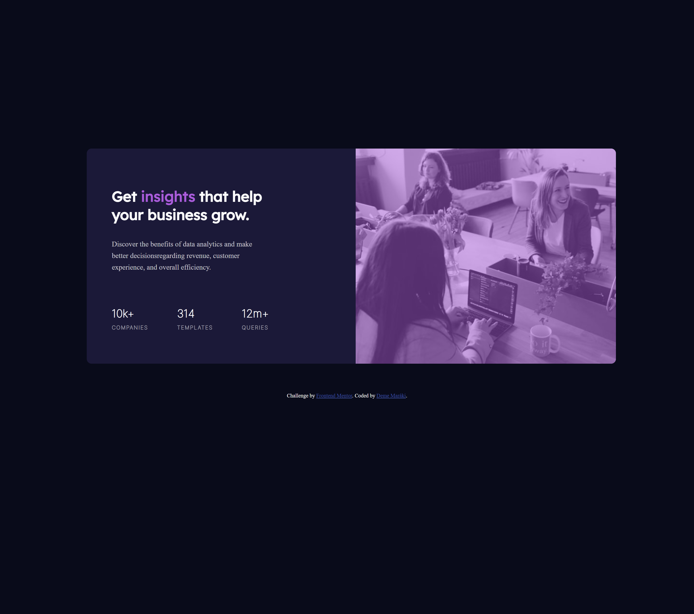
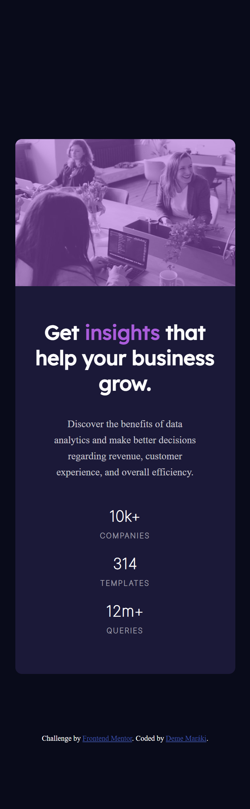

# Frontend Mentor - Stats preview card component solution

This is a solution to the [Stats preview card component challenge on Frontend Mentor](https://www.frontendmentor.io/challenges/stats-preview-card-component-8JqbgoU62).

## Table of contents

- [Overview](#overview)
  - [The challenge](#the-challenge)
  - [Screenshot](#screenshot)
  - [Links](#links)
- [My process](#my-process)
  - [Built with](#built-with)
- [Author](#author)

## Overview

### The challenge

Users should be able to:

- View the optimal layout depending on their device's screen size

### Screenshot

Desktop:

Mobile:

### Links

- Repository URL: [https://github.com/Subject6735/stats-preview-card-component](https://github.com/Subject6735/stats-preview-card-component)
- Live Site URL: [ https://subject6735.github.io/stats-preview-card-component/](https://subject6735.github.io/stats-preview-card-component/)

## My process

### Built with

- Semantic HTML5 markup
- CSS custom properties
- Flexbox

## Author

- Frontend Mentor - [@Subject6735](https://www.frontendmentor.io/profile/Subject6735)
